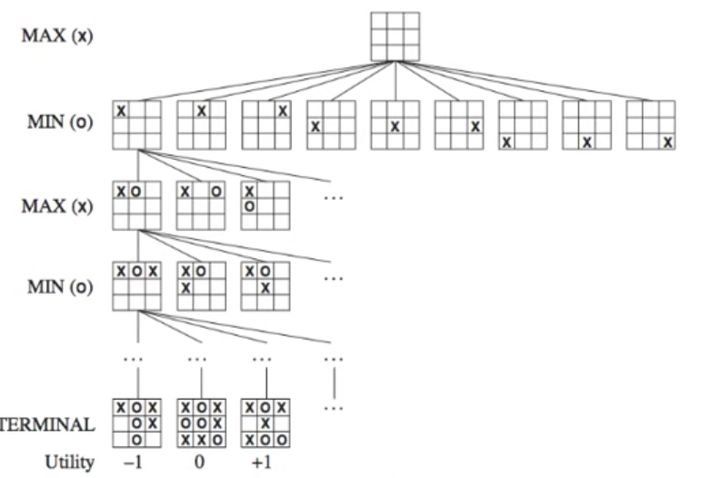
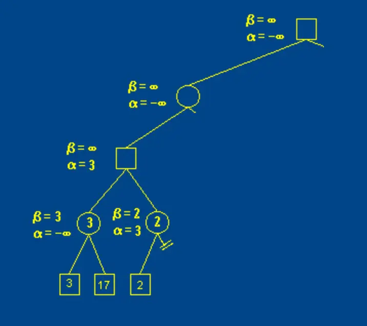
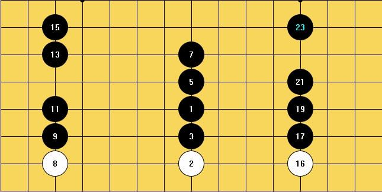
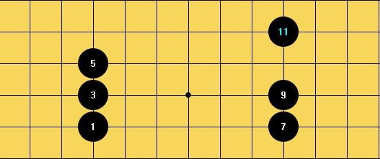

# 五子棋

本项目代码已发布于[GitHub](https://github.com/Baokker/GobangwithAI)

## 功能

在设计和开发的过程中，我们分别完成了两个版本的程序。前期为了测试算法和调试方便，我们先完成了命令行界面的版本，可以通过键盘输入坐标进行下棋。后期开发过程中，我们另外学习了Qt开发的知识，使用[Qt5.9](https://doc.qt.io/archives/qt-5.9/index.html)完成了图形化界面两种版本的程序。两种版本的AI均采用相同算法，具有相同的算力（可在`Const.h`中修改深度以改变算力）。

### 命令行版本

#### 双人对战

- 选择`1-player vs player` 
- 默认先下黑子
- 玩家A，B轮流键盘输入坐标a，b，表示在坐标(a,b)下棋
- 系统判断合理性，若不符合重新输入
- 若满足连成五子，则输出胜者，退出游戏

#### 人机对战

- 选择`2-player vs AI`
- 玩家可选择先下/后下（`1-BLACK 2-WHITE`）
- 默认先下黑子
- 玩家输入坐标a，b，表示在坐标(a,b)下棋
- 若为玩家输入，则系统判断合理性，不符合会提示重新输入；若为AI输入，则AI会计算并落子，下完后会提示AI刚才在哪里落了子。
- 若满足连成五子，则输出胜者，退出游戏

### 图形化版本

图形化进入默认为双人对战，可通过上方的菜单栏进行切换。

#### 双人对战

- 在左上方菜单栏选择`Person VS Person` 
- 默认先下黑子
- 玩家A，B轮流用鼠标落子
- 若满足连成五子，则输出胜者，退出游戏

#### 人机对战

- 在左上方菜单栏选择`Person VS Computer` 
- 玩家可选择先下/后下（`AI first`和`Player first`）
- 默认先下黑子
- 玩家用鼠标落子，随后AI落子，轮流进行
- 若满足连成五子，则输出胜者，退出游戏

## 设计

### 数据结构

在存储棋盘上各个位置的落子情况时，我们采用了二维数组进行存储，这样既容易与真实的棋盘分布直接联系起来，也方便直接进行随机访问。

### AI算法

#### 极大极小算法

极大极小算法（Minmax algorithm）是处理零和博弈游戏对抗的经典算法之一。为确保能够实现这个算法，需要确保该游戏同时具有“零和”和“完全信息”两个特征。所谓“零和”，表示玩家双方在游戏中不可能同时获益，要么我方获利，要么敌方获利；所谓“完全信息”，表示玩家可以同时获取游戏中相关的全部信息（因此，打扑克牌显然不能采用极大极小算法，因为敌方的手牌对我方来说是非透明的）。因此，极大极小算法可以应用在跳棋、五子棋、象棋等棋类游戏中。在这两个基础之上，极大极小算法假设，玩家每次都会**按照可以使自己当前局势利益最大化的方向出手**。而又由于游戏中双方不可能同时获利，这也意味着，己方利益的最大化，意味着敌方利益的最小化。换言之，对我方来说，我方每次都会执行使我方利益最大化的步骤，而敌方则会执行使我方利益最小化的步骤。

接下来的问题是，如何让计算机判断，当我方下了某步棋子后，局势对我方的有利程度呢？我们采取打分的方法。对每一种棋类游戏来说，不同的棋型都具有不同的含义。在较为简单的国际跳棋里，我方*连满三子*，即表示游戏取得胜利，这显然对于我方来说，是一个有利的情况；在五子棋里，当敌方下出*活三*时（一种活三的情况为，三颗同种颜色的棋子在上下、左右、或斜对角线上连成一条线，且两旁都没有其他颜色的棋子堵住），那对于我方来说，再不下子去堵住活三，我方就无法阻止其连成五子，这显然是对我方来说相当不利的情况。如果可以根据例如*连满三子*或*活三*这样的情况，**对每种情况进行不同权值的加分**，进而就可以对整个棋盘进行打分。

解决完打分的问题后，我们就可以分析所有可能的落子情况，进行DFS递归。大体的示意图如下所示（以三字棋为例）：



在进行递归前，我们先设置一个`depth`变量，表示极大极小算法最多递归到第n层。随后对棋盘进行逐层展开，形成[博弈树](https://wiki.mbalib.com/wiki/%E5%8D%9A%E5%BC%88%E6%A0%91)。设算法函数名为`minmax`。

对上图进行分析。第一次执行`minmax`函数，先进入第一层MAX层，表示我方。此时棋盘为空，对我方来说，可以有3*3共9种落子的方法。而我方需要做的，就是在这9种落子方法中，找到对我方利益最大，最可能使我方获胜的落子点。接下来，对这每一种落子情况，第二次调用`minmax`函数，此时为MIN层，表示为敌方下棋。对敌方来说，由于我方已经下过一子，所以ta会有8种落子的方法。敌方此时的目的，就是找出这8种里对ta利益最大（亦即对我方利益最小）的下法。

接下来，轮到第二层MAX的`minmax`算法，我方有7种下法..递归搜索不断反复进行，直到达到`depth`或者终结情况（例如，某方获胜）为止。在图中的第一个TERMINAL情况里，白子（敌方）获得了胜利，对我方是不利的结果，评分为-1；在第三个TERMINAL里，我方获得了胜利，则评分为1。显然，敌方会选择使第一种情况出现的落子，我方则会选择使第三种情况出现的落子。在递归达到终止后，返回此状态下棋盘的评分，以便在上一层递归里，对不同的落子情况的评分进行比较，选择最优者。

伪代码如下：

```
function minimax(node, depth) // node表示当下的棋盘情况
    if node is a terminal node or depth == 0 // 终止情况，达到最大深度或终止结点
        return the heuristic value of node // 返回评分，供上一层递归进行比较
    if the adversary is to play at node // 敌方落子
        let α := +∞
        for each child of node
            α := min(α, minimax(child, depth-1)) // 敌方会选择对我方最不利的下法
    else {we are to play at node}
        let α := -∞
        for each child of node
            α := max(α, minimax(child, depth-1)) // 我方会选择对我方最有利的下法
            if (α changes && depth == 0) new_node = child // 如果需要记录下一步下子，可以在第一层递归里，当α发生变化时记录。
    return α // 返回评分值，方便上一层递归比较
```

值得一提的是，无论是上文的minmax算法，或是下文的alpha-beta剪枝算法，其本质上都用到了**回溯**。因此，需要保存当前函数里的棋盘状态，而不能在几次递归后丢失了原数据。为此，要么产生新的副本，在副本上进行递归，不影响原来的棋盘；要么，在原棋盘上进行操作，但在下完一子之后，**记得要归位！**

#### alpha-beta剪枝算法

前文对minmax算法进行了大篇幅的讲解，这样有利于减少分析ab剪枝时的难度。minmax算法虽然较为简单，但最致命的弱点是，算法复杂度实在太高。




上图中，正方形表示我方（alpha层，对应minmax算法中的MAX层），圆形表示敌方（beta层，对应minmax算法中的MIN层）。α表示**当前情况下我方的得分最大值**，**β表示当前情况下敌方的得分最小值**，**当α＞β时，就可以直接剪枝，退出该分支。**

例如图中当β=2，α=3时，ab剪枝便会生效，直接退出该分支下的递归。这里面的原理，其实简单来说就是：在前一个（左边一个分支）里，我们已经知道，α的值为3，我方的得分如果要更新，必须比3还大；而在接下来的分支里，又已知β为2，代表**β的分数再怎么更新，都比2要小**，也就意味着，对我方更不利。在这种情况下，就没有必要再去考虑这个分支后面的情况。

伪代码如下：

```
// node表示当前节点，depth表示深度，Player表示玩家类型（AI或玩家）
// 之后的DEPTH表示在代码外部已经定义好的深度
function alphabeta(node, depth, α, β, Player) 
     if depth = 0 or node == terminal //达到理想深度或为终端情况
         return the heuristic value of node // 返回评分，供上一层递归进行比较
     if Player == AI //我方AI下棋
         for each child of node // 遍历每种可能发生的情况
             v = alphabeta(child, depth - 1, α, β, PLAYER)) // 递归
             if (v > α && depth == 0) new_node = child // 如果需要记录下一步下子，可以在第一层递归里，当α发生变化时记录
             α := max(α, v)
             if β ≤ α
                 break // β裁剪
         return α //返回对AI方最有利的落子得分
     else // 对手PLAYER下棋
         v := ∞
         for each child of node // 遍历每种可能发生的情况
             v := min(v, alphabeta(child, depth - 1, α, β, AI)) // 递归
             β := min(β, v) // 更新上界
             if β ≤ α
                 break // α裁剪
         return β //返回对player方最有利的落子得分
```

调用时直接

```
alphabeta(node,DEPTH,-∞, +∞，AI)
```

即可。

#### 开发过程中碰到的难点

- boardEvaluate函数

  如何对五子棋上的棋盘进行打分？在五子棋术语中，存在各种各样的基本棋型。例如下图表示冲四：连成了四个子，但是被挡住了：

  

  下图表示活三（在上文有介绍）：

  

  遍历棋盘上的每个棋子，并对其棋型进行打分，正数表示对我方有利，负数（敌方形成的棋型）表示对我方不利，加分总和即为评分。

  ```
  int Gobang::evaluate(int x, int y, int chessType)
  {
  	int sum = 0;
  	//四个方向估值
  	for (int i = 0; i < 4; i++)
  	{
  		SituationType type = GetSituationType(x, y, i, chessType);
  		switch (type)
  		{
  		case BeFive:
  			sum += BE_FIVE; // 和下面的常量一样，都是预先设好的分数
  			break;
  		case ActiveFour:
  			sum += ACTIVIE_FOUR;
  			break;
  		case RushFour:
  			sum += RUSH_FOUR;
  			break;
  		case ActiveThree:
  			sum += ACTIVIE_THREE;
  			break;
  		case SleepThree:
  			sum += SLEEP_THREE;
  			break;
  		case ActiveTwo:
  			sum += ACTIVE_TWO;
  			break;
  		case SleepTwo:
  			sum += SLEEP_TWO;
  			break;
  		default:
  			sum += OTHER;
  			break;
  		}
  	}
  	return sum;
  }
  
  ```

- generateNext函数

  对于一般的五子棋来说，像三字棋那样，直接将所有未落子的位置加入到可能的节点中，显然是不合适的。一方面，即使假设每次只放入100个可选的走法，如果以minmax算法递归四次后，总共便需要执行10^8次了，这个处理次数显然过多了；另一方面，generateNext函数本身便具有较长的运行时间，在前期开发时甚至出现过AI一个棋子下了半分钟，而90%都在generate的情况。为此，我们对generateNext函数进行了大量的优化，以确保其尽量少产生无用的走法，减少博弈树的分支。

  伪代码如下：

  ```
  generateNext(chessBoard,chessType):
  	vector result // 存储坐标
  	for i in range(BoardSize):
  		for j in range(BoardSize):
  			if 满足我方在chessBoard[i][j]下子后连成五子
  				result.push(Point(i,j)) //存入坐标
  	
  	if (result.size()>0) return result
  	
  	for i in range(BoardSize):
  		for j in range(BoardSize):
  			if 满足敌方在chessBoard[i][j]下子后连成五子
  				result.push(Point(i,j)) //存入坐标
  				
  					if (result.size()>0) return result
  				
  	for i in range(BoardSize):
  		for j in range(BoardSize):
  			if 满足我方在chessBoard[i][j]下子后连成四子
  				result.push(Point(i,j)) //存入坐标
  				
  	if (result.size()>0) return result
  				
  	for i in range(BoardSize):
  		for j in range(BoardSize):
  			if 满足敌方在chessBoard[i][j]下子后连成四子
  				result.push(Point(i,j)) //存入坐标
  				
  	if (result.size()>0) return result
  				
  	for i in range(BoardSize):
  		for j in range(BoardSize):
  			if 满足我方在chessBoard[i][j]下子后连成活三
  				result.push(Point(i,j)) //存入坐标
  				
  	if (result.size()>0) return result
  				
  	for i in range(BoardSize):
  		for j in range(BoardSize):
  			if chessBoard[i][j]周围棋子数量大于2 // 适用于刚开始的情况
  				result.push(Point(i,j)) //存入坐标	
                  
      if (result.size()>0) return result
  ```

  虽然函数颇长，但是思路是很明确的。

  首先，必须先把最有利的情况纳入结果中，这既包括我方的棋子达到某种有利局势，也包括阻止对方的棋子达到有利局势。在实在没有棋势的情况下，通过搜索周围棋子数量来加入选项，减少无关分支。

  另外一方面，我们假设，**如果当下有一个更优的下法，就没有必要考虑优先级不如它的下法。**譬如说，有活四我绝不去下活三，之类。所以当某个循环里找到并加入了合适的条件后，就直接返回result。

  这样，我们既减少了generate的时间，又尽可能地减少了分支。

- ab剪枝的优化

  在ab剪枝里，除了对β ≤ α的情况进行剪枝外，还可以对必胜的棋盘进行剪枝。当打分显然大于连成五子所得的分数时，意味着已经取得胜利，也就没必要再对下面的情况进行计算。

  ```			
  if (alpha >= BE_FIVE) break;
  ```

#### 结果

通过一系列的算法优化和改进，我们的程序可以以较理想的速度进行深度为10的alpha-beta剪枝算法。

## 开发流程

- 搭建棋盘，实现棋盘class
- 搭建命令行版本架构（main函数）
- 实现双人对战
- 实现人机对战
  - 实现alpha-beta剪枝算法
  - 实现电脑AI
  - 优化运行速度
- 实现命令行版本
- 实现图形化版本

## 图形化

- 该程序的图形化使用QT creator平台，借助平台上的各种工具来实现游戏的图形化运行。

  - 用QTpainter的相关语句，通过使用darwline将棋盘画出，使用drawRect和drawEllipse将棋子的落点he棋子画出。

  - 用QMenu设计游戏的菜单，在菜单中可以选择PVP和PVE，在PVE中可以选择Computer first或Player first。

  - 用QAction做出按下选择的响应，不同的选择调用不同的函数，从而实现游戏的各项功能。

  - 用QMessageBox做出游戏结束的弹窗，通过内部函数判断游戏的输赢或平局，然后弹窗告诉玩家结果，并结束游戏。

  - 用QMouseEvent来检测鼠标在窗口上的位置，通过调用相关函数，来将鼠标的位置与棋盘关联起来，并通过鼠标的点击来实现下棋。


## 测试

### 命令行版本


### 图形化版本


## 运行

### 命令行

- 最好在cmd中运行，否则游戏结束会直接退出

  1. Win+R 输入`cmd`
  2. 切换到当前路径（例如，输入`e:`，再输入`cd GobangForSubmit\ExecutableFile\CommandLineVersion`
  3. 运行`GobangwithAI.exe`

- 或者在`main.cpp`的`main`函数最后加上

  ```cpp
  system(pause);
  ```

  随后重新编译

### 图形化

- Windows平台可进入GobangForSubmit\ExecutableFile\GraphicalVersion路径，下载.exe文件，然后直接打开即可


- 若版本不兼容或使用其他平台，可以进入GobangForSubmit\Source\GraphicalVersion\Gobang路径，然后使用Qt打开Gobang.pro,编译运行即可体验
  - 如果无法打开，只需要删除项目中的.user 文件，再打开，打开后再点configure project，重新配置，重新构建，然后就能正常打开了

